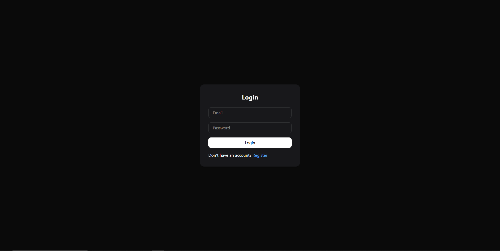
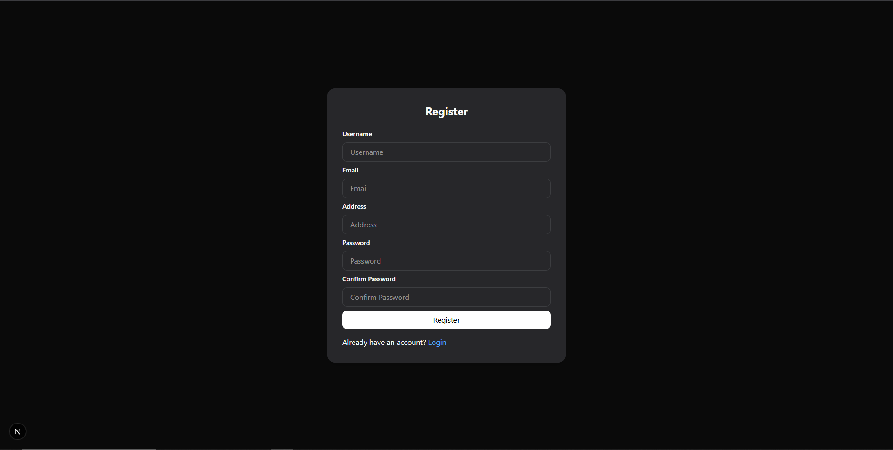
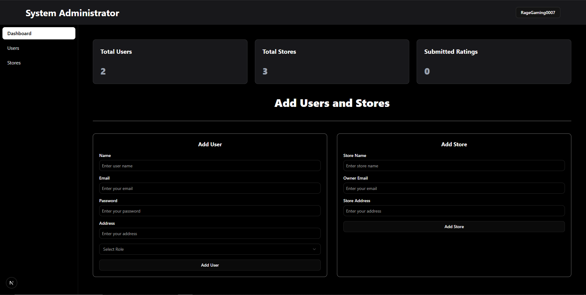
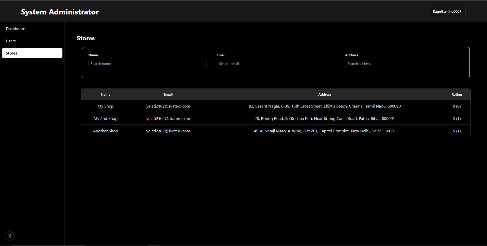
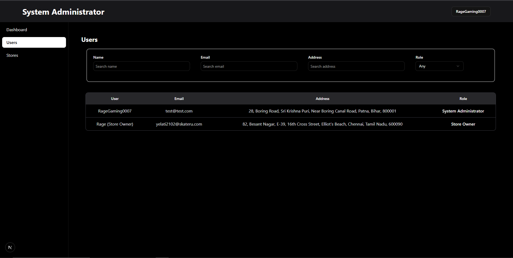
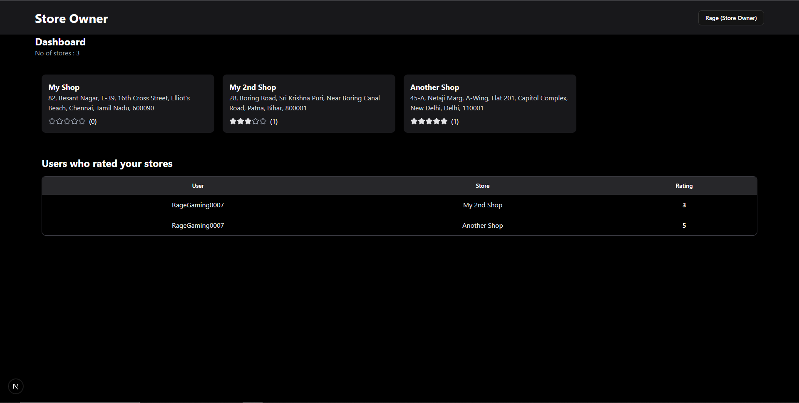
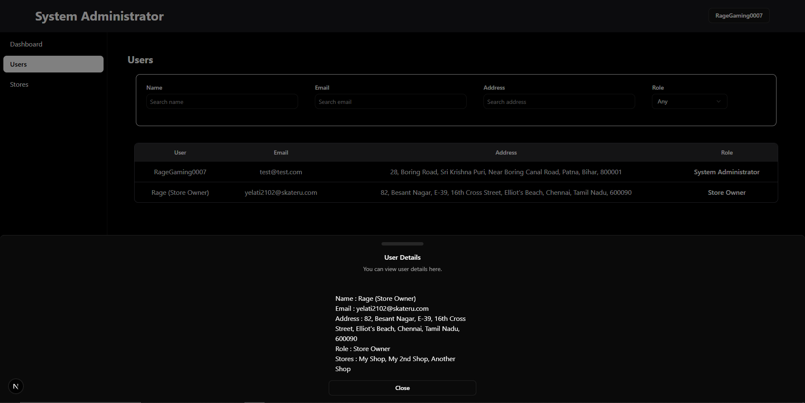
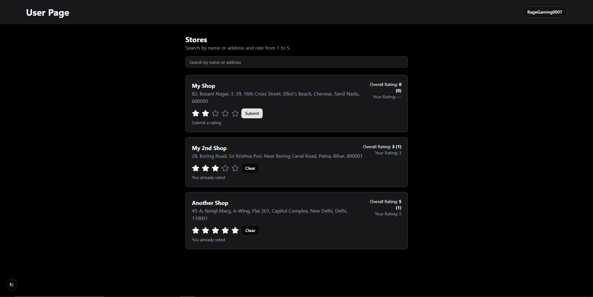

# Full Stack Store Rating Platform

This project is a **Full Stack Web Application** built as part of the **Roxiler Systems FullStack Intern Coding Challenge**.  
It enables users to register, log in, and submit ratings for stores, with role-based access control for **System Administrators, Normal Users, and Store Owners**.

---

## 🚀 Tech Stack

- **Frontend:** React.js (with TailwindCSS & modern UI practices)
- **Backend:** Node.js with Express.js
- **Database:** MySQL
- **Authentication:** JWT-based login system
- **Other Tools:** REST APIs, bcrypt for password hashing

---

## 🔑 User Roles & Functionalities

### 👑 System Administrator
- Add new stores, normal users, and admin users.
- Dashboard view with:
  - Total number of users  
  - Total number of stores  
  - Total number of ratings  
- Manage users with filters (Name, Email, Address, Role).
- View user details (including store ratings if they are Store Owners).
- Secure logout functionality.

### 🙋 Normal User
- Register with **Name, Email, Address, Password**.
- Login & update password.
- Browse all registered stores.
- Search for stores by **Name** or **Address**.
- Submit, update, and view store ratings (1–5).
- View their own rating for each store.
- Secure logout functionality.

### 🏪 Store Owner
- Login & update password.
- Dashboard to view:
  - List of users who rated their store  
  - Average rating of their store  
- Secure logout functionality.

---

## 🛡️ Form Validations

- **Name:** 20–60 characters  
- **Address:** Max 400 characters  
- **Password:** 8–16 characters, must include at least one uppercase letter & one special character  
- **Email:** Standard email format validation  

---

## 📊 Additional Features
- Sorting support on all tables (ascending/descending).
- Role-based access with protected routes.
- Clean UI with responsive design.
- Secure password storage using hashing.


---

## ⚙️ Installation & Setup

### 1. Clone the repository
```bash
git clone https://github.com/Rage-Gaming/Store-Rating.git
cd store-rating
```

### 2. Download SQL and Insert

* [Download schema.sql](https://github.com/Rage-Gaming/Store-Ratingraw/main/Docs/schema.sql)


### 3. Clone the repository
```bash
git clone https://github.com/Rage-Gaming/Store-Rating.git
cd store-rating

cd backend
pnpm install

#or

npm install
```

#### Create a .env file:
```
NODE_ENV =

MYSQL_HOST = 
MYSQL_USER = 
MYSQL_DATABASE = 
MYSQL_PASSWORD =
MYSQL_PORT = 

JWT_SECRET = 
```

---

## 📸 Screenshots
* Login Page


* Register Page
  

* Admin Dashboar
  

* Admin Store View
  

* Admin User View
  

* Shop Owner
 

 * User Details 
 

 * User Rating 
 

---

## ✅ Best Practices Followed
* Modular backend with MVC pattern.

* Secure authentication & authorization.

* Clean UI with TailwindCSS and reusable components.

* Proper database schema normalization.

* Environment variable configuration.


---

## 📌 Notes

* This project was developed as part of the Roxiler Systems FullStack Intern Coding Challenge.

* Submission includes both frontend and backend implementations with proper validations.